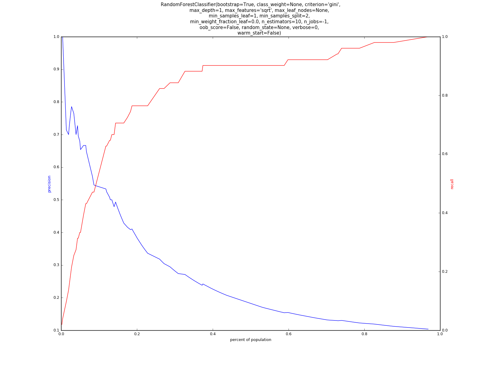

#Machine Learning Tutorial

This module illustrates some basic machine learning in Python using Sci-Kit Learn.

We do not assume *a priori* that any single model will be best for the data. Instead, we loop over multiple classfiers and parameterizations. In this way, we can run hundreds of models and select the best one on a variety of metrics, such as precision and recall.

### Example Precision / Recall Plot



---

## Quick Start Guide

Example data for this repository comes from the [General Social Survey (GSS) 2014](http://gss.norc.org/get-the-data/stata). More notes on the data preprocessing are detailed in the [data](data/) folder.

To run the example:

```bash
git clone https://github.com/jmausolf/Python_Tutorials
cd Python_Tutorials/Machine_Learning
python run.py
```
