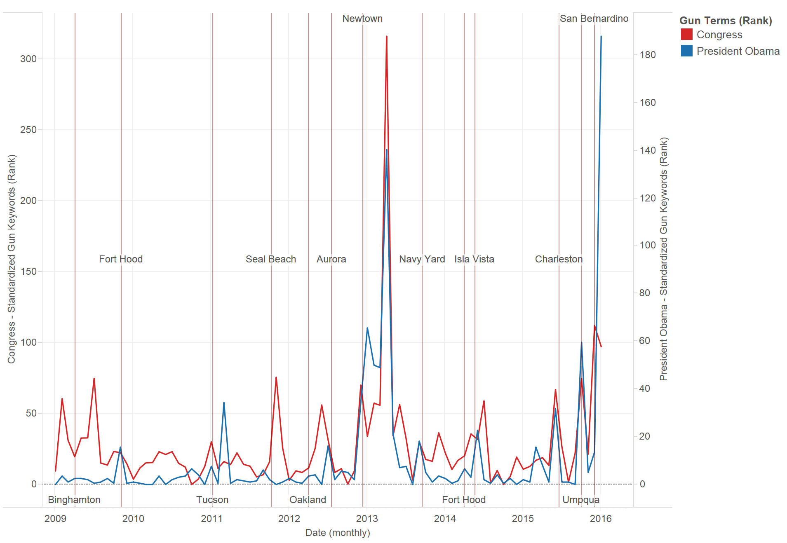

# Welcome to Text Keyword Counter

This package allows you to analyze a set of `.txt` text files and quantify the count of a given set of keywords and phrases. It returns a .CSV of the results, which can be used to generate various graphs:

### [Discussion of Guns by President Obama and Congress, 2009-2016](https://public.tableau.com/views/DiscussionofGunsbyPresidentObamaandCongress2009-2016/Story1?:embed=y&:display_count=yes)


---

# Dependencies

To run this package, you will need several functions.

1. This package was written on a MAC OSX system. It has not been tested on Linux or Windows.
2. This package requires an Anaconda Distribution of Python, either 2.7+ or 3.5+. See [https://www.continuum.io/downloads](https://www.continuum.io/downloads). Although these packages should be included, you can install them if needed:

	* NLTK `pip install NLTK`


# To Run

1. Git clone this repository:
	```git clone https://github.com/jmausolf/Python_Tutorials/```

2. Navigate to the Python Scripts folder in this repository and run the example:

	```bash
	cd Text_Keyword_Counter
	python find_keywords.py
	```

To learn more about the code, please check out the [tutorial](https://github.com/jmausolf/Python_Tutorials/blob/master/Text_Keyword_Counter/Analyzing_Text_in_Python.Rmd).

---
